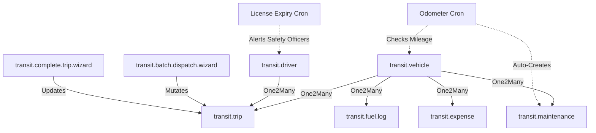

# 🚚 TransitOps: Smart Transport Operations Platform

<div align="center">

[](https://www.odoo.com)
[](https://www.python.org)
[](https://www.postgresql.org)
[](https://github.com/odoo/owl)
[](https://www.gnu.org/licenses/lgpl-3.0.html)

**An enterprise-grade fleet logistics, dispatch, and financial tracking system designed to eliminate spreadsheet chaos and automate compliance in real-time.**

[Explore Features](#-core-features) • [Quick Start](#-quick-start) • [Architecture](#-architecture) • [Security & RBAC](#-security--rbac)

</div>

---

## 📋 Table of Contents
1. [Problem Statement](#-problem-statement)
2. [Solution Overview](#-solution-overview)
3. [Architecture](#-architecture)
4. [Core Features](#-core-features)
   - [Live Guard Panel (Pre-Flight Checks)](#1-live-guard-panel-pre-flight-checks)
   - [Interactive Wizards & Operations](#2-interactive-wizards--operations)
   - [Automated Schedulers (Cron Jobs)](#3-automated-schedulers-cron-jobs)
   - [Visual Analytics & Dynamic Dashboards](#4-visual-analytics--dynamic-dashboards)
5. [Tech Stack](#-tech-stack)
6. [Module Structure](#-module-structure)
7. [Security & RBAC](#-security--rbac)
8. [Quick Start](#-quick-start)
9. [Automated Verification (Test Suite)](#-automated-verification-test-suite)

---

## 🔍 Problem Statement

In modern logistics and transport operations, organizations face severe operational hurdles when managing fleets manually:
- **Scheduling Conflicts & Double Bookings:** Dispatching a vehicle or driver already on a trip, causing operational bottlenecks.
- **Compliance & Safety Violations:** Accidentally assigning drivers with suspended statuses or expired licenses.
- **Overloading Hazards:** Exceeding maximum vehicle load capacity, resulting in fines, wear and tear, and accidents.
- **Reactive Maintenance:** Missing mileage milestones and running vehicles to failure instead of performing preventive servicing.
- **Financial Blindspots:** Fragmented logging of fuel consumption, tolls, and maintenance bills, leading to hidden operating costs.

---

## 💡 Solution Overview

**TransitOps** solves these problems by providing a centralized, rules-enforced, and visually stunning digital cockpit.

Every transaction—whether registering a vehicle, hiring a driver, dispatching a trip, or logging fuel—is guarded by active validation scripts. Automated background jobs track license expiries and mileage thresholds, auto-generating maintenance tickets and removing non-compliant assets from the dispatch pool. Real-time cost roll-ups give financial analysts complete transparency over the total cost of ownership (TCO) and return on investment (ROI) for each vehicle.

---

## 🏗️ Architecture

TransitOps is built as a modular Odoo custom addon utilizing a model-view-controller relationship linked directly to Odoo's Web/OWL layer:



### Data Relations & Computations
1. **Trip Lifecycle:** `Draft` ➔ `Dispatched` (locks vehicle & driver) ➔ `Completed` (triggers fuel log & odometer update) / `Cancelled` (releases vehicle & driver).
2. **Dynamic Operational Costs:**
   $$\text{Total Operational Cost} = \text{Fuel Logs Cost} + \text{Closed Maintenance Cost} + \text{Toll Costs}$$
3. **Vehicle ROI:**
   $$\text{ROI (\%)} = \left(\frac{\text{Total Trip Revenue} - \text{Total Operational Cost}}{\text{Acquisition Cost}}\right) \times 100$$

---

## 🚀 Core Features

### 1. Live Guard Panel (Pre-Flight Checks)
The form view of `transit.trip` features a **Live Guard Panel** (`dispatch_guard_html`) rendered via a custom HTML widget:
* **Reactive Validation:** Updates in real-time as users modify the cargo weight, vehicle, or driver.
* **Checks Performed:**
  * Checks if the assigned vehicle status is `available`.
  * Verifies if the driver's license status is `valid` or `expiring` (not `expired`).
  * Assesses cargo weight against the vehicle's `max_load_capacity`.
* **Visual Progress Bar:** An embedded capacity usage bar turns **Green** (safe), **Amber** (>90% full), or **Red** (overloaded, showing the exact overflow in kilograms).

### 2. Interactive Wizards & Operations
* **Batch Dispatch Wizard:** Select multiple draft trips in the list view and dispatch them in a single click. The wizard runs pre-flight safety and capacity checks for all selected records, generating a unified status report.
* **Complete Trip Wizard:** Prompts the operator for the `final_odometer` reading, `fuel_consumed` (liters), `fuel_cost`, and any `toll_cost`. It ensures the new odometer reading is greater than the previous one before closing the trip.

### 3. Automated Schedulers (Cron Jobs)
* **Odometer Milestone Checker:** Runs daily. If a vehicle accumulates 10,000+ km since its last maintenance date (or total since acquisition), the scheduler posts an alert to the vehicle's chatter and auto-creates an active maintenance record, shifting the vehicle to `In Shop` status.
* **License Expiry Alert:** Automatically scans driver records daily. If a driver's license expires in $\le 30$ days, it flags the status as `expiring`, sends warning alerts to the chatter, and logs scheduled activities for **Safety Officers** to process renewals.

### 4. Visual Analytics & Dynamic Dashboards
* **Kanban Boards:** Drag-and-drop cards for fleet vehicles and drivers, dynamically grouped by operational state.
* **Calendar Views:** Grid view displaying trip pipelines over weekly/monthly timelines.
* **OWL 19 Custom Dashboard:** A high-speed dashboard client action built using the Odoo Web Library (OWL). Displays real-time operational metrics like fleet utilization rate, active trips, and license warning tickers with one-click drilldowns.

---

## 🛠️ Tech Stack

* **Backend Engine:** Python 3.10+ & Odoo 19.0 Framework (using MVC decorators, API depends, constraints)
* **Database:** PostgreSQL (with indexed constraints)
* **Frontend Layer:** XML views, Odoo Web Client Action, custom Javascript (OWL Component), CSS variables, and modern glassmorphic theme overrides (`theme.css`)

---

## 📂 Module Structure

```text
transit_ops/
├── __init__.py
├── __manifest__.py                 # Addon metadata, asset registrations, & view load order
├── controllers/
│   └── main.py                     # HTTP endpoints for analytics & CSV exports
├── security/
│   ├── security.xml                # RBAC groups (Managers, Dispatchers, Safety, Finance)
│   └── ir.model.access.csv         # Comprehensive access control list (ACL) rules
├── data/
│   ├── sequence_data.xml           # Auto-generating Trip ID sequences
│   └── cron_data.xml               # Background daily schedulers
├── models/
│   ├── transit_vehicle.py          # Fleet registry, cost calculations, & SQL constraints
│   ├── transit_driver.py           # Driver profiles, license tracking, & eligibility
│   ├── transit_trip.py             # Pre-flight guard panel, lifecycle, & dispatch checks
│   ├── transit_maintenance.py      # Maintenance logs & auto-status management (In Shop)
│   ├── transit_fuel_log.py         # Fuel log registrations
│   ├── transit_expense.py          # Cost center aggregations
│   └── transit_cron_helpers.py     # Scheduler logic
├── wizard/
│   ├── batch_dispatch_wizard.py    # Multi-dispatch wizard logic
│   └── complete_trip_wizard.py     # Trip completion data capture
├── static/
│   ├── description/                # Module icon and descriptions
│   └── src/
│       ├── css/theme.css           # Custom CSS variables, glassmorphism, & dark mode compatibility
│       ├── js/dashboard.js         # OWL Dashboard Controller
│       └── xml/dashboard.xml        # OWL Dashboard Template
├── views/
│   ├── vehicle_views.xml           # Vehicle forms, lists, search, & kanbans
│   ├── driver_views.xml            # Driver forms, lists, search, & kanbans
│   ├── trip_views.xml              # Trip forms with the Live Guard Panel HTML widget
│   └── dashboard_client_action.xml # Custom action registration
└── tests/
    └── test_transit_ops.py         # Automated unit test suite
```

---

## 🔐 Security & RBAC

TransitOps enforces **Role-Based Access Control (RBAC)** across four explicit operations roles:

| Model | Fleet Manager | Dispatcher | Safety Officer | Financial Analyst |
| :--- | :---: | :---: | :---: | :---: |
| **transit.vehicle** | `CRUD` | `Read` | `Read` | `Read` |
| **transit.driver** | `CRUD` | `Read` | `CRUD` | `No Access` |
| **transit.trip** | `CRU` | `CRUD` | `Read` | `Read` |
| **transit.maintenance** | `CRUD` | `Read` | `No Access` | `No Access` |
| **transit.fuel.log** | `CRU` | `Read` | `No Access` | `CRUD` |
| **transit.expense** | `RU` | `No Access` | `No Access` | `CRUD` |

---

## ⚙️ Quick Start

### Prerequisites
- Python 3.10+
- PostgreSQL Server 14+
- Git

### 1. Clone & Set Up Directory
```powershell
git clone https://github.com/Gurjas2112/odoo_hackathon_2026.git
cd odoo_hackathon_2026
```

### 2. Configure Virtual Environment & Dependencies
```powershell
python -m venv venv
.\venv\Scripts\Activate.ps1
pip install -r requirements_filtered.txt
```

### 3. Start Odoo (Auto-Reload Enabled)
Configure the connection params in `odoo.conf` and spin up the service:
```powershell
.\venv\Scripts\python.exe odoo-src\odoo-bin -c odoo.conf -d hackathon_test_db -u transit_ops --dev=all
```
*The `--dev=all` flag enables automatic reloading of Python classes, controllers, and XML views upon file saves.*

### 4. Open in Web Browser
Open your browser and navigate to:
**`http://localhost:8069`**

---

## 🧪 Automated Verification (Test Suite)

TransitOps includes unit tests covering safety rules, double bookings, status transitions, and capacity overflows.

Run the test suite using:
```powershell
.\venv\Scripts\python.exe odoo-src\odoo-bin -c odoo.conf -d hackathon_test_db --test-enable --stop-after-init -u transit_ops
```

*Expected output upon successful execution:*
```text
INFO hackathon_test_db odoo.tests.result: 0 failed, 0 error(s) of 10 tests when loading database 'hackathon_test_db'
```
